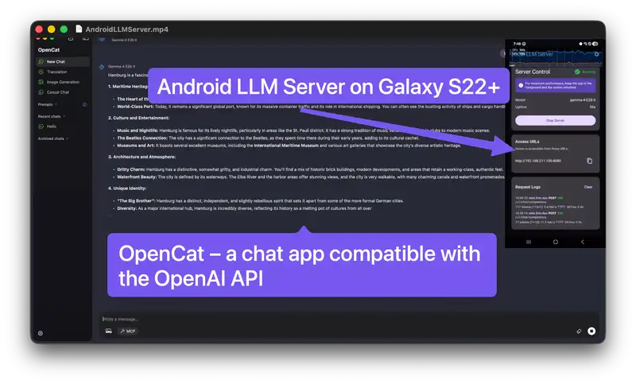
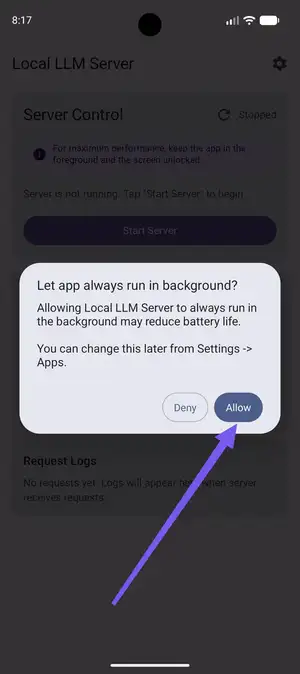
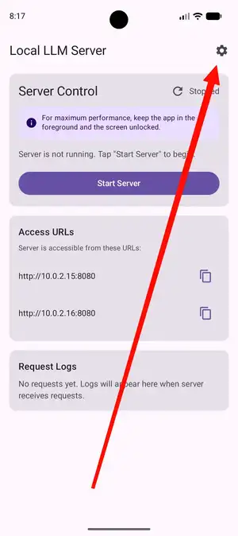
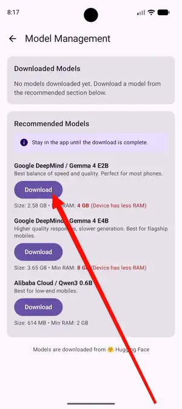
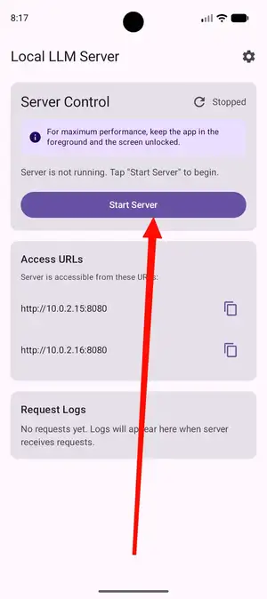

# Local LLM Server for Android

**High-performance, private AI on the edge.** Run world-class models like [Google DeepMind's Gemma 4](https://ai.google.dev/gemma/docs/core/model_card_4) locally on your own Android hardware. Powered by Google's [LiteRT](https://ai.google.dev/edge/litert-lm) with [OpenAI-compatible API](api/README.md) access.

<center>

[](https://youtu.be/zsQF3ADZYfU)
<br>
*Demo Video: Local LLM Server Gemma 4 E2B on Samsung Galaxy S22+ with OpenChat Client (click image to play)*

</center>

## What Is This?

Transform your Android phone into a high-performance, private AI server. This project was born from a mission to give an over four-year-old Samsung Galaxy S22+ a "second life" by repurposing its powerful GPU for dedicated local inference.

**Outsource your AI workload to a dedicated mobile server.** Instead of competing for VRAM on your primary workstation or paying for cloud subscriptions, you can leverage the high-efficiency silicon in flagship smartphones.

*   **Re-use old flagships:** Older high-end devices make incredible AI servers. Even devices with cracked screens or damaged displays are perfect for this role.
*   **Superior cost & power efficiency:** Running models on a smartphone is significantly more power-efficient than using a desktop GPU. While an NVIDIA card might draw 300W-450W, a smartphone performs at a fraction of that power (typically <15W), making it much cheaper to run 24/7.
*   **Easy hardware access:** High-end GPUs can be expensive and hard to source. In contrast, used flagship smartphones are affordable and widely available on the second-hand market.
*   **Absolute Privacy:** Chat with state-of-the-art models like Google DeepMind's Gemma 4 entirely on-device. Your data never leaves your local network.
*   **AI Sovereignty:** Own your intelligence. By running models locally on your own hardware, you achieve complete independence from cloud provider terms of service, arbitrary pricing changes, or unexpected outages.

Access the server via an OpenAI-compatible API from any device on your local WiFi network.

**No cloud. No subscriptions. Your data never leaves your device.**

## Requirements

- Smartphone with a modern GPU
- 4GB+ RAM (8GB recommended)
- 3-5GB free storage per model
- Android 16+ (API 36+)
- WiFi connection

## Installation

[](https://github.com/Cyclenerd/android-llm-server/releases/latest)

[**Download APK**](https://github.com/Cyclenerd/android-llm-server/releases/latest) from releases and install on your device.

⚠️ **Not available on Google Play** due to aggressive performance optimizations and prioritizing performance over battery life (see Battery Warning below).


## Quick Start

| Step | Instruction |
| :---: | :--- |
|  | **Battery Optimization:** On first launch, grant the app a battery optimization exemption. Select **"Don't optimize"** or **"Allow"** to ensure the server remains active in the background. |
|  | **Model Settings:** Tap the gear icon (**⚙️**) on the dashboard to access the model management and download screen. |
|  | **Model Selection:** Choose a model such as **Gemma 4 E2B** and wait for the download to complete (typically 5–15 minutes). |
|  | **Launch Server:** Return to the dashboard and tap **Start Server**. The engine will take 10–30 seconds to initialize the model on your GPU. For maximal performance keep the app in foreground and don't lock your phone. |

Note the server URL (e.g., `http://10.0.2.15:8080`)

## Make Your First Request

**From any device on same WiFi:**

```bash
# Replace 10.0.2.15 with your device's IP
curl http://10.0.2.15:8080/v1/chat/completions \
  -H "Content-Type: application/json" \
  -d '{
    "model": "gemma-4",
    "messages": [{"role": "user", "content": "Hello!"}]
  }'
```

**Python (OpenAI SDK):**

```python
from openai import OpenAI

client = OpenAI(
    base_url="http://10.0.2.15:8080/v1",  # Your device IP
    api_key="not-needed"
)

response = client.chat.completions.create(
    model="gemma-4",
    messages=[{"role": "user", "content": "Hello!"}]
)

print(response.choices[0].message.content)
```

## Available Models

| Model | Size | RAM Needed | Speed |
|-------|------|------------|-------|
| **Google DeepMind Gemma 4 E2B** | 2.4G | 4GB+ | Fast (recommended) |
| **Google DeepMind Gemma 4 E4B** | 3.4G | 8GB+ | Slower, better quality |

For a quick overview of what's possible with Gemma 4, check out this [introductory video](https://www.youtube.com/watch?v=-01ZCTt-CJw).

## Performance

Running LLMs on Android presents unique challenges compared to desktop/server environments due to limited power, thermal constraints, and memory bandwidth.

### Local LLM Server Gemma-4-E2B Benchmarks

Total time executing `api/examples.sh` against Local LLM Server on:

| Device | Chipset | CPU | GPU | Total Time |
| :--- | :--- | :--- | :--- | :---: |
| **Samsung Galaxy S26 Ultra** | Qualcomm SM8850-1-AD Snapdragon 8 Elite Gen 5 (3 nm) | Octa-core (2x4.74 GHz Oryon V3 Phoenix L + 6x3.62 GHz Oryon V3 Phoenix M) | Adreno 840 (1.3GHz) | **1:21.40** |
| **Samsung Galaxy Tab S10+ (SM-X820)** | Mediatek Dimensity 9300+ (4 nm) | Octa-core (1x3.4 GHz Cortex-X4 & 3x2.8 GHz Cortex-X4 & 4x2.0 GHz Cortex-A720) | Immortalis-G720 MC12 | **2:17.49** |
| **Samsung Galaxy S22+ (Europe)** | Exynos 2200 (4 nm) | Octa-core (1x2.8 GHz Cortex-X2 & 3x2.50 GHz Cortex-A710 & 4x1.8 GHz Cortex-A510) | Xclipse 920 | **3:16.91** |

### Google Deepmind's Gemma-4-E2B Benchmarks

| Platform (Device) | Backend | Prefill | Decode | TTFT | Peak Memory |
| :--- | :---: | :---: | :---: | :---: | :---: |
| **Android (S26 Ultra)** | GPU | 3,808 tk/s | 52 tk/s | 0.3s | 676 MB |
| **macOS (MacBook Pro M4)** | GPU | 7,835 tk/s | 160 tk/s | 0.1s | 1,623 MB |
| **Linux (RTX 4090)** | GPU | 11,234 tk/s | 143 tk/s | 0.1s | 913 MB |

*TTFT: Time to First Token. Benchmarks based on the 2.58 GB Gemma-4-E2B model ([Source](https://ai.google.dev/edge/litert-lm/overview#featured_model_gemma-4-e2b)).*

## Battery Warning

⚠️ **This app prioritizes performance over battery life:**
- Screen stays on (prevents GPU throttling)
- CPU runs at full speed always
- Battery drains 2-5x faster than normal
- Device gets warm/hot during use

**Recommendation: Keep device plugged in during use, but disable Fast Charging.** High CPU/GPU usage combined with rapid charging generates significant heat, which may lead to thermal throttling or overheating.

## API Details

**Endpoint:** `http://<device-ip>:8080/v1/chat/completions`

**Compatible with:** OpenAI Python SDK, LangChain, any OpenAI-compatible client

**Authentication:** None (local network only)

**Streaming:** Supported (set `"stream": true`)

**Sampling Config (Fixed):**
- Temperature: 1.0
- Top-P: 0.95
- Top-K: 64

The model always generates complete responses. Parameters like `max_tokens` and `temperature` from OpenAI API are ignored for consistency and performance.

Explore the [Detailed API Documentation & Examples](api/README.md) for comprehensive endpoint specifications and advanced integration guides.

## Troubleshooting

### "Connection refused"
- Ensure server is running (check dashboard)
- Use correct IP from dashboard
- Connect from device on same WiFi

### Server won't start
- Check model is downloaded
- Ensure device has 4GB+ free RAM
- Close other apps to free memory

### Slow responses
- Budget devices are naturally slower
- Use smaller model (Gemma 4 E2B)
- Ensure battery optimization is disabled

### Battery drains too fast
This is expected. App runs at maximum performance. Keep device plugged in.

## Security

**Local network only.** Server binds exclusively to private IP addresses (192.168.x.x, 10.x.x.x). Cannot be accessed from internet.

**No authentication.** Protected by network isolation. Secure your WiFi.

**No limits.** No rate limiting, prompt length limits, or token caps. Your hardware determines limits naturally.

⚠️ **Do not expose to public internet.**

## ADB Commands

If you manage your device remotely or want to automate the server, you can use the [Android Debug Bridge](https://developer.android.com/tools/adb) (ADB).

**Launch the app:**
```bash
adb shell am start -n de.cyclenerd.android.llm.server/.ui.MainActivity
```

**Stop the app:**
```bash
adb shell am force-stop de.cyclenerd.android.llm.server
```

## For Developers

Built entirely in **Kotlin**, this project leverages Jetpack Compose for the UI, Ktor for the HTTP server, and LiteRT for the inference engine. Notably, **AI assistance was used heavily in the development of this project**, assisting in everything from architectural decisions to implementation.

See [`CONTRIBUTING.md`](CONTRIBUTING.md) for development setup.

See [`ARCHITECTURE.md`](ARCHITECTURE.md) for technical details.

## License

This project is licensed under the [Apache License 2.0](./LICENSE).

### Credits & Assets

*   **Download Badge:** Generated using graphics from [Logowik](https://logowik.com/download-android-apk-badge-vector-logo-19952.html).
*   **Social Preview:** Created with Nano Banana using source imagery from [this YouTube video](https://i.ytimg.com/vi/3bYOCovyEYU/maxresdefault.jpg).

## Disclaimer

This project is an independent Open Source initiative and is not affiliated with, endorsed by, or associated with Google, Deepmind, Hugging Face or OpenAI. All trademarks and registered trademarks are the property of their respective owners.
